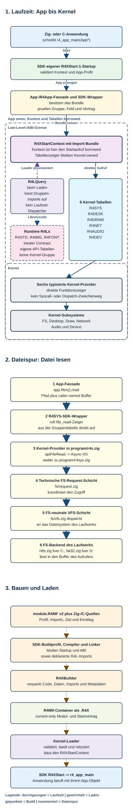

# R4OS API architecture and getting started

The public program interface has two layers:

1. Six platform groups implemented as built-in Kernel providers: R4SYS,
   R4DESK, R4DRAW, R4NET, R4AUDIO and R4DEV. They keep versioned `Query:1`
   imports but have no R4L file or independent installation/update path.
2. Independent Runtime-R4L libraries such as R4STD, R4IMG and R4FONT, each
   with its own versioned function table.

The canonical platform schema is
`Repositories/Contract/API/ApiContract.json`. Generated Zig/C layouts,
kernel tables and the references in this directory must agree with it. The
SDK adds typed facades but does not define a second ABI.



## Call path

A module declares imports in `module.R4MF`. The loader resolves every required
table against built-in Platform APIs or loaded Runtime-R4Ls and enters
`R4XStart:1`. SDK startup validates the context and creates an `App` view. A
normal file read, for example, follows:

```text
application -> SDK file facade -> R4SYS table -> kernel VFS -> NTFS/FAT32
```

The application owns its buffers. The facade validates paths and buffer
lifetimes and returns typed success/failure states; it does not provide an
alternative filesystem implementation.

## First module

1. Start from an SDK Zig or C R4X template.
2. Set identity, source, imports, target and image scope in `module.R4MF`.
3. Initialize the SDK application context in the entry point.
4. Request only the facades needed by the module.
5. Build with the repository's `Build.bat` or
   `Tools\Build.bat -module <Role\Project>`.

Every optional group and function remains explicit. Zig uses `hasFn` on the
typed context; C uses the matching generated availability helpers. Missing
requirements return `err_no_group` or `err_no_fn` rather than a silent
fallback.

## Ownership rules

- Borrowed pointers are valid only for their documented call lifetime.
- Caller buffers remain owned by the caller; asynchronous buffers stay valid
  until completion and close.
- Resource wrappers are consumed exactly once by close, join, release, wait
  or reap as appropriate.
- R4DESK and R4DRAW objects are owner-thread-only unless stated otherwise.
- Runtime-R4L contexts validate module, API major, revision, table size and
  required slots before exposing functions.

Start with `Readme.txt`, `AppEntry.md` and `AppContract.md`. Generated
operation and payload details are in `OperationContracts.md` and
`PayloadTypes.md`.
